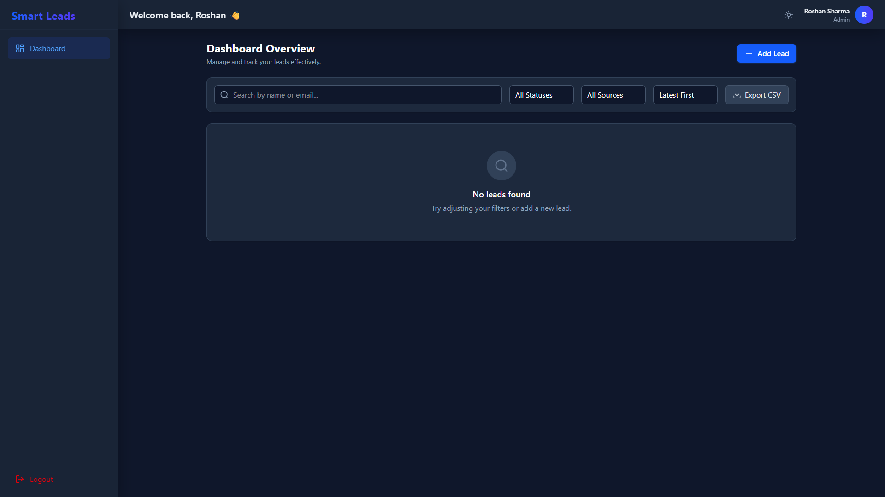
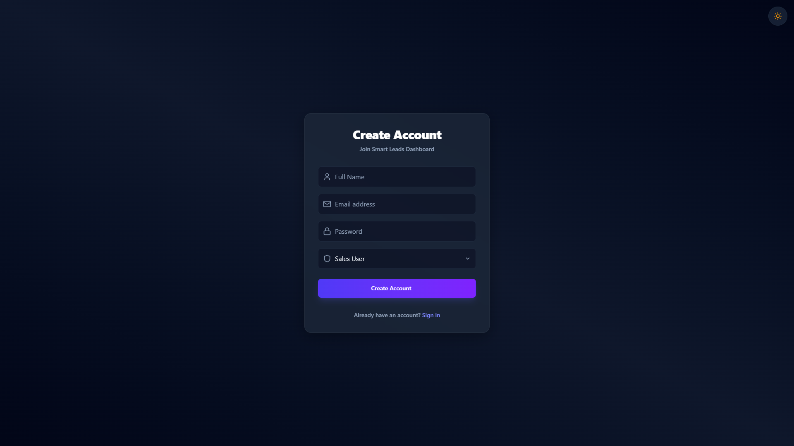

# Smart Leads Dashboard

A full-stack Lead Management Dashboard built using the MERN stack (MongoDB, Express.js, React.js, Node.js) with clean architecture, scalable code practices, and a professional user experience.

## Features

- **Authentication System**: Secure JWT-based authentication with user registration, login, protected routes, and Role-Based Access Control (Admin, Sales User).
- **Leads Management**: Full CRUD operations for managing leads.
- **Advanced Filtering & Search**: Filter leads by Status, Source, sort by Latest/Oldest, and debounced search by Name or Email. Multiple filters work together seamlessly.
- **Pagination**: Server-side pagination built-in (10 records per page).
- **Responsive UI**: Built with React, TailwindCSS, and Lucide Icons. Features a modern dark mode, glassmorphism UI, loading states, and form validations.
- **CSV Export**: Export filtered data to a CSV file.
- **Docker Ready**: Fully containerized setup for quick deployment.

## Tech Stack

- **Frontend**: React (Vite), TypeScript, TailwindCSS v4, Zustand, Axios, React Router v7.
- **Backend**: Node.js, Express.js, TypeScript, MongoDB, Mongoose, JWT, bcrypt.

## Quick Start (Docker)

1. Clone the repository
2. Open terminal in the project root directory
3. Run the following command:
   ```bash
   docker-compose up --build
   ```
4. Access the frontend at `http://localhost:5173` and the backend at `http://localhost:5000`

## Manual Setup Instructions

### Prerequisites
- Node.js (v18+)
- MongoDB running locally or a MongoDB Atlas URI

### 1. Setup Backend
```bash
cd backend
npm install
cp .env.example .env
# Edit .env to add your MONGODB_URI and JWT_SECRET
npm run build
npm start
# For development: npm run dev
```

### 2. Setup Frontend
```bash
cd frontend
npm install
npm run dev
```
Open `http://localhost:5173` in your browser.

## API Documentation

### Auth Routes
- `POST /api/auth/register` - Register a new user
  - Body: `{ name, email, password, role }`
- `POST /api/auth/login` - Login to account
  - Body: `{ email, password }`

### Leads Routes (Requires Bearer Token)
- `GET /api/leads` - Get all leads (with pagination, filtering, search, sorting)
  - Query Params: `status`, `source`, `search`, `sort`, `page`, `limit`
- `POST /api/leads` - Create a new lead
  - Body: `{ name, email, status, source }`
- `GET /api/leads/:id` - Get a single lead
- `PATCH /api/leads/:id` - Update a lead
- `DELETE /api/leads/:id` - Delete a lead (Admin only)

## Screenshot




